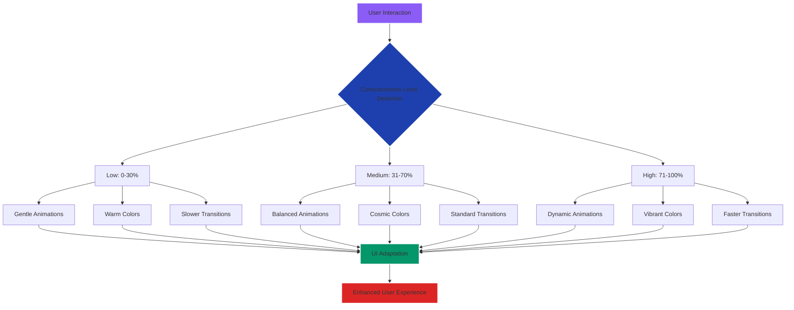

# Aetheria - Interactive Component & Micro-Interaction Specifications

**Author:** Manus AI  
**Date:** October 1, 2025  
**Version:** 1.0

## 1. Introduction

This document outlines the interactive components and micro-interaction specifications for Aetheria, focusing on creating a consciousness-responsive interface that adapts to user behavior and spiritual state. The interaction design emphasizes smooth, meaningful animations that enhance the cosmic consciousness experience.

## 2. Core Interactive Components

### 2.1. Consciousness-Responsive UI System

The consciousness-responsive UI represents the most innovative aspect of Aetheria's interaction design, creating an interface that dynamically adapts based on the user's tracked consciousness level and emotional state.



**Implementation Specifications:**
- **Consciousness Level Tracking:** Real-time monitoring through user interaction patterns, assessment responses, and explicit user input
- **Color Adaptation:** Dynamic color palette shifts based on consciousness state (warm oranges for low, cosmic purples for medium, vibrant blues for high)
- **Animation Speed:** Variable animation durations (slow: 800ms, medium: 500ms, fast: 300ms)
- **Particle Density:** Adaptive particle count (low: 50 particles, medium: 100 particles, high: 200 particles)

### 2.2. Ultra-Glassmorphism Card System

The glassmorphism card system provides the foundation for all content containers within Aetheria, featuring sophisticated transparency and blur effects.

**Interaction States:**
1. **Default State:** `backdrop-filter: blur(20px)`, `background: rgba(255,255,255,0.1)`, `border: 1px solid rgba(255,255,255,0.2)`
2. **Hover State:** `backdrop-filter: blur(25px)`, `background: rgba(255,255,255,0.15)`, `transform: translateY(-2px)`, `box-shadow: 0 20px 40px rgba(139,92,246,0.3)`
3. **Active State:** `backdrop-filter: blur(30px)`, `background: rgba(255,255,255,0.2)`, `transform: translateY(0px)`, `box-shadow: 0 10px 20px rgba(139,92,246,0.4)`

**Animation Specifications:**
- **Transition Duration:** 300ms for all state changes
- **Easing Function:** `cubic-bezier(0.4, 0, 0.2, 1)` for smooth, natural movement
- **Shimmer Effect:** Periodic shimmer animation every 5 seconds using CSS gradients

### 2.3. Premium Button Components

Premium buttons feature sophisticated interaction patterns with ripple effects, gradient animations, and consciousness-responsive styling.

**Button Variants:**
- **Cosmic:** Primary action buttons with purple-to-pink gradients
- **Ethereal:** Secondary buttons with blue-to-cyan gradients  
- **Sacred:** Tertiary buttons with gold-to-orange gradients
- **Ghost:** Transparent buttons with border-only styling

**Micro-Interaction Sequence:**
1. **Hover Entry:** Gradient shift (200ms), scale increase to 1.02 (150ms), glow effect appearance (100ms)
2. **Click/Tap:** Ripple effect from touch point (400ms), scale decrease to 0.98 (100ms), haptic feedback (mobile)
3. **Release:** Scale return to 1.02 (100ms), ripple fade completion (200ms)
4. **Hover Exit:** Gradient return (200ms), scale return to 1.0 (150ms), glow fade (100ms)

### 2.4. Floating Navigation System

The floating navigation provides persistent access to all major sections while maintaining visual elegance through sophisticated positioning and animation.

**Navigation States:**
- **Collapsed:** Circular button with cosmic icon, positioned bottom-right
- **Expanded:** Radial menu with 6 primary navigation options
- **Transitional:** Smooth morphing animation between states

**Expansion Animation Sequence:**
1. **Initial Trigger:** Scale pulse effect (200ms)
2. **Background Expansion:** Circular background grows from center (300ms)
3. **Icon Stagger:** Navigation icons appear with staggered timing (50ms intervals)
4. **Completion:** Subtle bounce effect for final positioning (150ms)

## 3. Advanced Micro-Interactions

### 3.1. Cosmic Particle Interaction

The cosmic particle system responds to user interactions, creating an immersive environment that feels alive and responsive.

**Interaction Behaviors:**
- **Mouse Movement:** Particles within 100px radius are attracted to cursor position
- **Click Events:** Burst of new particles from click location (10-15 particles)
- **Scroll Actions:** Particle flow direction changes based on scroll velocity
- **Consciousness Level:** Particle color and movement speed adapt to user's spiritual state

### 3.2. Progress Indicator Animations

Progress indicators throughout Aetheria feature sophisticated animation patterns that provide clear feedback while maintaining visual elegance.

**Circular Progress Animation:**
- **Initial Load:** Smooth arc drawing from 0° to target percentage (1000ms)
- **Value Updates:** Smooth interpolation between old and new values (500ms)
- **Completion Effect:** Subtle pulse and color shift when reaching 100%

**Linear Progress Animation:**
- **Fill Animation:** Smooth width transition with gradient overlay
- **Pulse Effect:** Periodic pulse animation during active loading states
- **Completion Celebration:** Brief shimmer effect across the entire bar

### 3.3. Data Visualization Interactions

Charts and data visualizations feature sophisticated interaction patterns that enhance data exploration while maintaining visual consistency.

**Chart Hover Interactions:**
- **Data Point Highlight:** Smooth scale increase and glow effect
- **Tooltip Appearance:** Glassmorphism tooltip with smooth fade-in
- **Axis Highlighting:** Subtle line emphasis for relevant axes
- **Legend Interaction:** Coordinated highlighting between legend and chart elements

## 4. Accessibility and Performance Considerations

### 4.1. Reduced Motion Support

All animations respect the `prefers-reduced-motion` media query, providing alternative interaction patterns for users with motion sensitivity.

**Reduced Motion Alternatives:**
- **Particle Systems:** Static cosmic background with subtle opacity variations
- **Transitions:** Instant state changes with color-only feedback
- **Progress Indicators:** Immediate value updates without animation
- **Navigation:** Instant expand/collapse without morphing effects

### 4.2. Performance Optimization

All micro-interactions are optimized for smooth 60fps performance across devices.

**Optimization Techniques:**
- **Hardware Acceleration:** All animations use `transform` and `opacity` properties
- **Efficient Selectors:** Minimal DOM queries and cached element references
- **Debounced Events:** Mouse movement and scroll events are debounced to prevent excessive calculations
- **Conditional Rendering:** Complex animations are disabled on low-performance devices

## 5. Implementation Guidelines

### 5.1. CSS Custom Properties

All interaction parameters are defined as CSS custom properties for easy customization and theming.

```css
:root {
  --consciousness-low-color: oklch(70% 0.15 45);
  --consciousness-medium-color: oklch(65% 0.25 290);
  --consciousness-high-color: oklch(70% 0.2 200);
  --transition-fast: 150ms cubic-bezier(0.4, 0, 0.2, 1);
  --transition-medium: 300ms cubic-bezier(0.4, 0, 0.2, 1);
  --transition-slow: 500ms cubic-bezier(0.4, 0, 0.2, 1);
}
```

### 5.2. JavaScript Event Handling

All interactive components use modern event handling patterns with proper cleanup and performance optimization.

**Event Delegation Pattern:**
- Single event listeners on container elements
- Efficient event target identification
- Proper cleanup on component unmount
- Throttled/debounced handlers for performance-critical events

This interaction specification ensures that Aetheria provides a sophisticated, responsive, and accessible user experience that adapts to each user's consciousness journey while maintaining the highest standards of modern web interface design.
