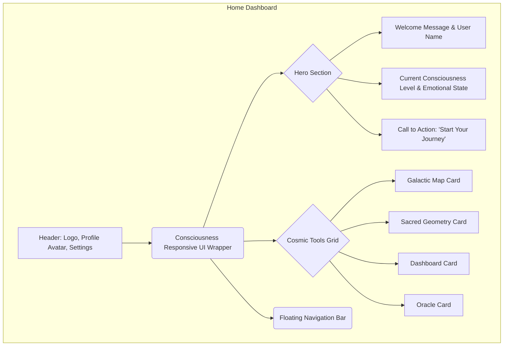

'''
# Aetheria - UI/UX Wireframe & Design System Documentation

**Author:** Manus AI
**Date:** October 1, 2025
**Version:** 1.0

## 1. Introduction

This document outlines the UI/UX wireframes and foundational design system for Aetheria, the ultimate platform for cosmic consciousness and spiritual awakening. The design philosophy is centered around creating an experience that is **sophisticated, intuitive, immersive, and transformative**, reflecting the profound nature of the content and features.

## 2. Application Architecture & User Flow

The following diagram illustrates the high-level architecture and primary user flows within the Aetheria application.

```mermaid
graph TD
    A[Splash/Login] --> B{Home Dashboard};
    B --> C[Galactic Map 3D];
    B --> D[Sacred Geometry Lab];
    B --> E[Cosmic Dashboard];
    B --> F[Assessments];
    B --> G[Oracle];
    B --> H[Profile];

    F --> F1[Personality Assessment];
    F --> F2[Starseed Assessment];
    F1 & F2 --> E;

    subgraph "Core Experiences"
        C;
        D;
        E;
    end

    subgraph "User Progression"
        F;
        G;
        H;
    end

    style A fill:#262626,stroke:#8b5cf6,stroke-width:2px
    style B fill:#262626,stroke:#8b5cf6,stroke-width:2px
    style C fill:#1e3a8a,stroke:#3b82f6,stroke-width:2px
    style D fill:#064e3b,stroke:#10b981,stroke-width:2px
    style E fill:#581c87,stroke:#a855f7,stroke-width:2px
    style F fill:#4a044e,stroke:#c026d3,stroke-width:2px
    style G fill:#831843,stroke:#ec4899,stroke-width:2px
    style H fill:#262626,stroke:#6b7280,stroke-width:2px
```

## 3. Wireframes

### 3.1. Home Dashboard

**Objective:** Provide a central hub for users to access all features, view their progress, and receive personalized guidance.

- **Layout:** A clean, spacious layout with a prominent hero section and a grid of interactive tool cards.
- **Key Elements:**
    - **Consciousness Responsive UI:** The entire interface subtly shifts color, particle effects, and animations based on the user's tracked consciousness level.
    - **Ultra-Glassmorphism Cards:** Each tool is represented by a premium card with hover effects, glow, and shimmer animations.
    - **Floating Navigation:** A sophisticated, expandable navigation component for easy access to all sections.

### 3.2. Galactic Map 3D

**Objective:** Create an immersive, interactive 3D experience for exploring starseed heritage.

- **Layout:** A full-screen 3D canvas with minimal UI overlays.
- **Key Elements:**
    - **Interactive 3D Starfield:** Users can rotate, zoom, and pan through a procedurally generated galaxy.
    - **Selectable Star Systems:** Key star systems (Pleiades, Sirius, etc.) are highlighted and can be clicked to view detailed information.
    - **Information Panel:** A glassmorphism panel appears with details about the selected star system, including traits, history, and user's connection percentage.
    - **Cosmic Particle System:** A dynamic particle background adds to the immersive feel.

### 3.3. Sacred Geometry Lab

**Objective:** Provide a creative and educational space for users to construct and interact with sacred geometry patterns.

- **Layout:** A main canvas area with side panels for tools and settings.
- **Key Elements:**
    - **Real-time Construction Canvas:** Users can draw and manipulate geometric forms.
    - **Tool Palette:** A selection of tools (circle, line, triangle) and patterns (Flower of Life, Metatron's Cube).
    - **Animation Controls:** Play, pause, and step-through the construction of complex patterns.
    - **Color & Style Customization:** Users can change colors, line weights, and effects.

## 4. Design System

### 4.1. Color Palette (OKLCH for consistency)

- **Primary/Focus:** `oklch(65% 0.25 290)` (Vibrant Purple)
- **Secondary:** `oklch(70% 0.2 200)` (Celestial Blue)
- **Accent/Gold:** `oklch(80% 0.15 90)` (Cosmic Gold)
- **Healing Green:** `oklch(75% 0.18 150)` (Emerald Green)
- **Love/Passion Pink:** `oklch(70% 0.22 340)` (Mystical Pink)
- **Background:** `oklch(15% 0.02 290)` (Deep Space Purple/Black)
- **Text/Primary:** `oklch(95% 0 0)` (White)
- **Text/Secondary:** `oklch(70% 0 0)` (Light Gray)

### 4.2. Typography

- **Headings:** `Inter`, Bold, Letter-spacing: `-0.02em`
- **Body:** `Inter`, Regular, Line-height: `1.6`
- **UI Elements:** `Inter`, Semibold

### 4.3. Core Components

- **UltraGlassmorphismCard:** The base for all container elements. Features backdrop-filter blur, subtle borders, and interactive glow/shimmer effects.
- **PremiumButton:** Animated buttons with gradient backgrounds, ripple effects on click, and consciousness-responsive hover states.
- **FloatingNavigation:** A compact, expandable navigation hub with icon-based buttons and tooltips.

This document provides the foundational blueprint for the Aetheria UI. The next step is to translate these wireframes and design system principles into high-fidelity visual design concepts.
'''
